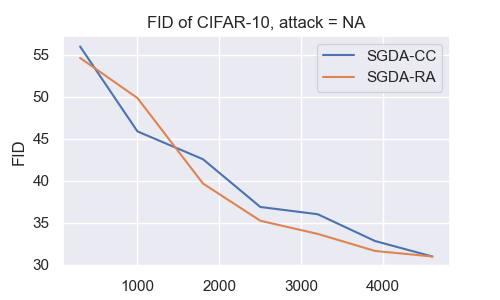
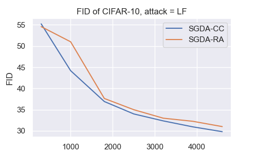
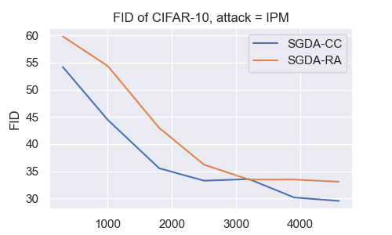
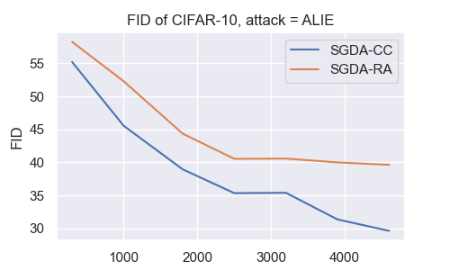

# VI-Robust-Aggregator

This is the official implementation of the Adversarial MNIST experiments and the CIFAR-10 GAN experiments in [Byzantine-Tolerant Methods for Distributed Variational Inequalities](https://openreview.net/forum?id=ER0bcYXvvo).


|  |  |
|-|-|
|  |   |

## Requirements
It is sufficient to have standard deep learning libraries, such as NumPy, Matplotlib, and PyTorch. For example, you can run this command:
```
    conda create -n NAMEOFMYENV pytorch torchvision torchaudio matplotlib numpy scikit-learn -c pytorch
```

In case you want to run the script `gan_fid.sh`, you have to install `pytorch-fid` as well (preferably inside your conda env):
```
    pip install pytorch-fid
```

## Running the experiments
Adversarial MNIST experiments can be run with:
```
    python run_adv_experiments.py --adversarial --use-cuda
```
CIFAR-10 GAN experiments can be run with:
```
    python run_experiments.py --gan --use-cuda
```

We also provide job scripts for running the experiments on SLURM, which can be easily adjusted for your compute cluster. There are also other scripts for running other experiments, but they can be safely ignored.

### Evaluating GAN experiments
Instead of sharing all model checkpoints, we provide code for sampling from the trained GAN model, which can be run with:
```
    sh gan_fid.sh <epochs>
```
where `<epochs>` denotes the model after running this number of epochs. The training script saves the model after every `--save-model-every` epochs.
The experiments log folders have to be in a folder called `outputs/gan/` relative to `gan_fid.sh`. This is created by default when running GAN experiments, and can be easily adjusted from `gan_fid.sh`.

The FIDs will be printed in the terminal. The FIDs can be collected automatically by saving the outputs in some file and then parsing it at the end. However, we have collected the FIDs manually in this experiment and hardcoded them in the plotting notebook.

### Plots for adversarial MNIST
You can reproduce the plots by navigating to Experiment 4 in `plot_adversarial.ipynb` and run the cells (after loading the libraries by running the very first cell in the notebook).

### Plots for GAN experiments
Simply run the cells in `plot_gan.ipynb`.

### Logs and pre-trained models
The data logs for the adversarial MNIST experiments can be downloaded from [here](https://mbzuaiac-my.sharepoint.com/:u:/g/personal/abdulla_almansoori_mbzuai_ac_ae/EUTVcCN66oJMvsxtTlPeWLUBtCmWIAAUtUZvmco_qTW98A?e=32oxeL), and the pre-trained models for the GAN experiments can be downloaded from [here](https://mbzuaiac-my.sharepoint.com/:u:/g/personal/abdulla_almansoori_mbzuai_ac_ae/Ebd8_9NefVdDsn5UFCGKdrcB3WKtLZqWXYqq7Vrl1BqGOw?e=Im7cOq).


## Acknowledgement
The backbone code was taken from [this repo](https://github.com/epfml/byzantine-robust-noniid-optimizer). The main script is called `utils.py`, which has been heavily changed from the original. The experiments can be run by calling the `main` function from this file, as can be seen from the `run_*.py` scripts.

